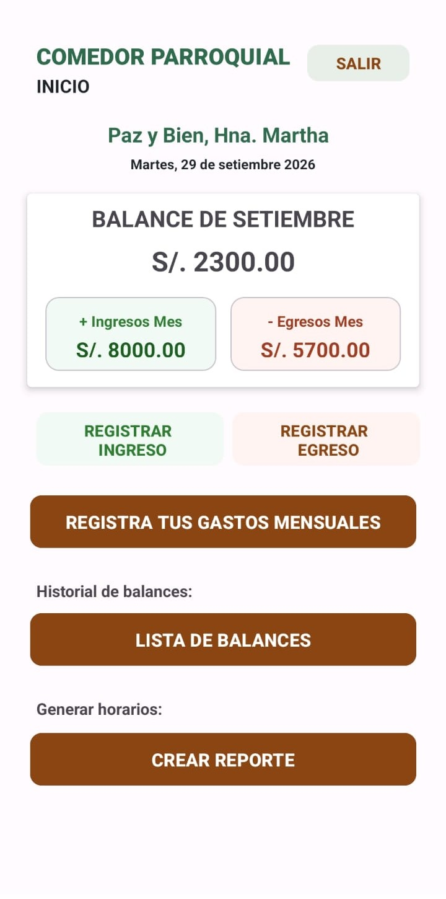
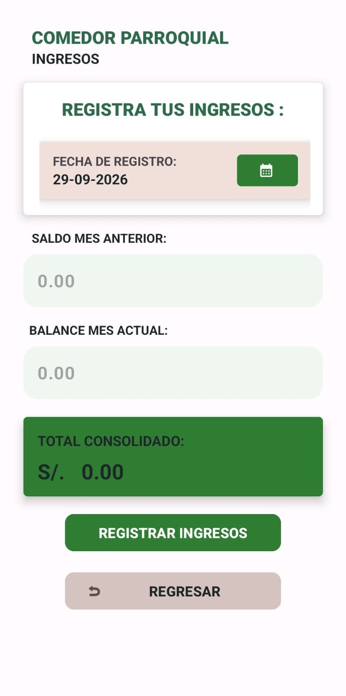
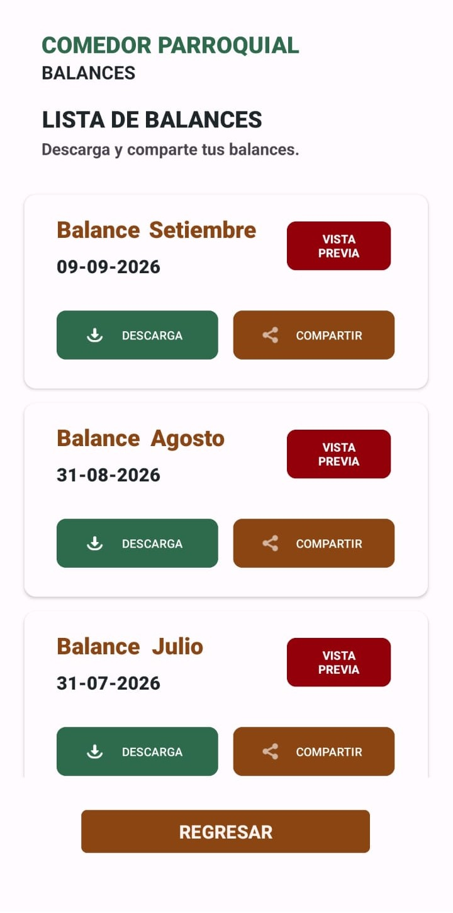
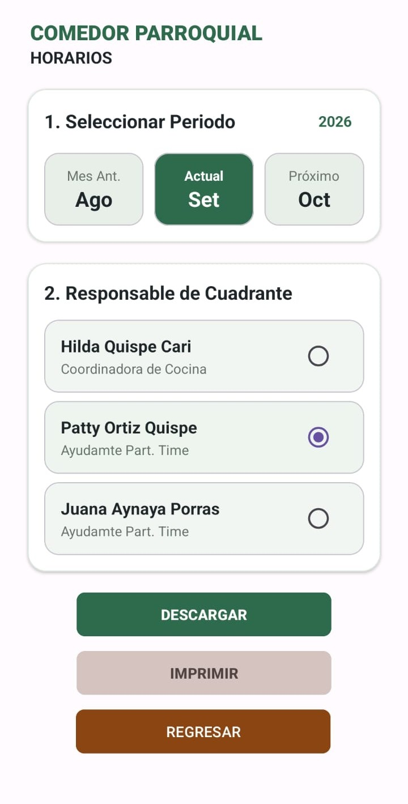
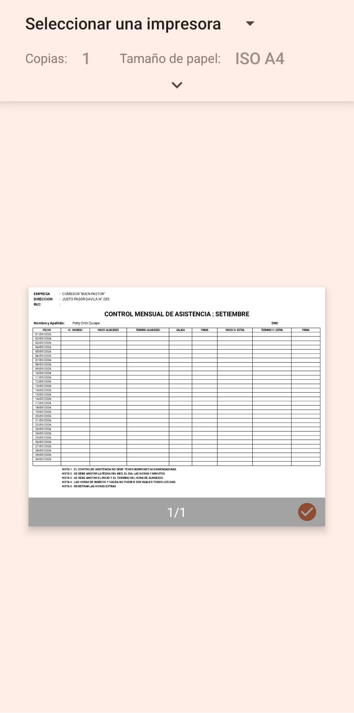

# Balance Parroquial

Aplicación Android desarrollada en Kotlin para la gestión y control financiero mensual de una parroquia.

Permite registrar ingresos, egresos y gastos mensuales, calcular balances, consultar históricos y generar reportes PDF, utilizando Firebase como backend.

[](https://github.com/AlexCarbajoG/Balance-Parroquial/actions/workflows/android-ci.yml)


---

## ¿Qué problema resuelve?

El control financiero mensual puede volverse difícil cuando los ingresos, egresos, gastos y balances se administran de forma separada o manual.

Balance Parroquial centraliza esta información en una aplicación Android que permite registrar movimientos, calcular resultados mensuales y generar documentos de respaldo en formato PDF.

## Objetivo del proyecto

Balance Parroquial busca facilitar el control financiero mensual de una parroquia, permitiendo registrar movimientos económicos, consultar balances y generar reportes en formato PDF.

## Capturas de la aplicación

### Inicio de sesión

| Login | Pantalla principal |
|---|---|
|  |  |

### Gestión financiera

| Registro de ingresos | Historial de balances |
|---|---|
|  |  |

### Reportes y documentos

| Generación de reporte | Vista previa PDF |
|---|---|
|  |  |

## Funcionalidades principales

- Registro de ingresos.
- Registro de egresos.
- Registro de gastos mensuales.
- Cálculo de balances mensuales.
- Consulta de historial de balances.
- Autenticación con Google.
- Almacenamiento de datos en Firebase Realtime Database.
- Generación de reportes PDF.
- Vista previa de información antes de generar reportes.
- Gestión de horarios.
- Compartir documentos PDF.

## Tecnologías utilizadas

- Kotlin
- Android Studio
- Firebase Authentication
- Firebase Realtime Database
- Google Sign-In
- Material Design Components
- RecyclerView
- ConstraintLayout
- CardView
- Gradle
- JUnit
- Espresso


## Arquitectura actual

Actualmente el proyecto utiliza una arquitectura en evolución, donde algunas Activities todavía acceden directamente a Firebase, mientras que parte de la lógica de negocio ya se encuentra separada.

```text
┌─────────────────────┐
│      Activities     │
│   Interfaz / UI     │
└──────────┬──────────┘
           │
      ┌────┴─────┐
      │          │
      ▼          ▼
┌────────────┐  ┌─────────────────────┐
│  Firebase  │  │     Repository      │
│ acceso     │  │ BalanceResumenRepo  │
│ directo    │  └──────────┬──────────┘
└────────────┘             │
                           ├──────────────► Firebase
                           │
                           ▼
                 ┌─────────────────────┐
                 │       Domain        │
                 │  BalanceCalculator  │
                 └─────────────────────┘
```

```text
app/
└── src/main/java/com/carbajo/checking/
    ├── activity/
    ├── adaptador/
    ├── data/
    ├── domain/
    ├── modelos/
    └── pdf/
```

## Calidad y pruebas

El proyecto incluye pruebas unitarias para validar la lógica central de cálculo de balances.

Actualmente se verifican escenarios como:

- Balance positivo.
- Balance igual a cero.
- Balance negativo.
- Diferentes combinaciones de ingresos y egresos.

Las pruebas se ejecutan con JUnit mediante:
### Windows
    .\gradlew testDebugUnitTest
### Linux/macOS
    chmod +x gradlew
    ./gradlew testDebugUnitTest

## Integración continua

El proyecto utiliza GitHub Actions para validar automáticamente cada Pull Request y cada cambio enviado a `main`.

El workflow ejecuta:

1. Configuración de Java.
2. Preparación de Gradle.
3. Ejecución de pruebas unitarias.
4. Compilación del APK debug.

Workflow:

    .github/workflows/android-ci.yml

## Roadmap

- [x] Registro de ingresos.
- [x] Registro de egresos.
- [x] Gestión de gastos mensuales.
- [x] Historial de balances.
- [x] Generación de reportes PDF.
- [x] Autenticación con Google.
- [x] Firebase Realtime Database.
- [x] Pruebas unitarias.
- [x] GitHub Actions CI.
- [ ] Ampliar cobertura de pruebas.
- [ ] Mejorar arquitectura por capas.
- [ ] Generar APK firmado para distribución.
- [ ] Automatizar publicación de releases.

## Release actual

Versión estable actual:

    v1.0.0

La release incluye documentación, pruebas unitarias, refactor de lógica de balance e integración continua con GitHub Actions.
